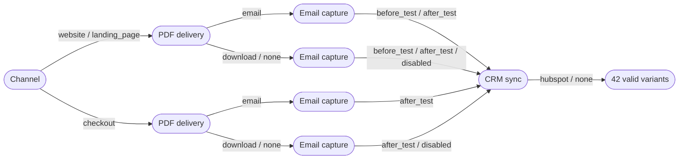
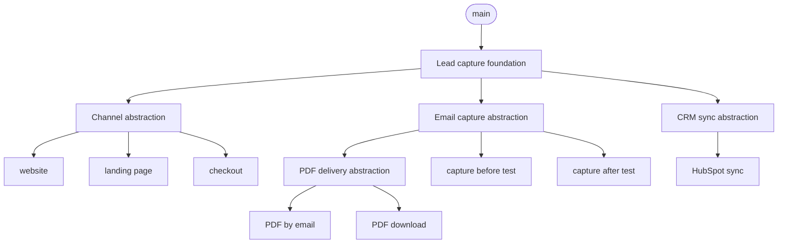

# Combinatorial Agentic Development

**Why choose a product path when you can implement the whole decision space?**

A skill for coding agents (Claude Code, Codex, anything that reads `SKILL.md`) for the feature where product has not decided yet. You tell the agent the open decisions. It counts every variant, throws out the impossible ones, builds each option exactly once behind a shared abstraction, and lays the work out as a stack of small merge requests. When the decisions change, and they will, it updates the plan and tells you which branches need a rebase.

Indecision, now with a dependency graph.

## Thirty seconds of it

> **You:** Lead capture flow. It runs on the website, a landing page, or in checkout. The PDF report goes out by email, as a download, or not at all. We capture the email before the test, after it, or never. HubSpot sync is optional. PDF by email needs an address, obviously, and checkout can't ask before the test.

The agent writes the spec, runs the numbers and reads them back before touching anything:

```text
Decision space
  Theoretical combinations              54   (3 × 3 × 3 × 2)
  Removed by constraints                12
  Valid variants                        42

Implementation     13 nodes: 1 foundation, 4 abstractions, 8 options, 0 interactions
Stack              tree, 8 lanes, 1 wave

Status  needs confirmation
  - 42 targeted variants exceed max_valid_variants (20).
  Options: proceed as planned, switch the test matrix to pairwise, ...

Product decisions made on your behalf: 0
```

42 products, 13 merge requests. Work scales with options while variants scale with their product, so the plan is built per option and the variants become the test matrix.

The planning document draws the decision tree. Every path from left to right is one valid variant, and identical branches are merged, so all 42 fit on one screen:



And the MR stack. PDF delivery sits on email capture because "PDF by email" needs an address; everything else runs in parallel lanes:



A week later:

> **You:** Emails can be HTML or plain text.

```text
Proposed spec change (not applied yet)
  + dimension email_format: html | text   (applies when pdf_delivery == email)

Impact
  valid variants 42 -> 52 (a plain dimension would have doubled it to 84)
  new MRs: dim.email_format, opt.email_format.html, opt.email_format.text
  started work affected: none
```

You say yes, the document gets revision 2 with a changelog entry, and your sign-off is cleared because the spec changed. See the full documents: [revision 1](examples/lead-capture-flow.md), [revision 2 with work in progress](examples/lead-capture-flow-r2.md), and the [dry-run output](examples/lead-capture-flow.dry-run.txt).

## Install

**Claude Code plugin**

```text
/plugin marketplace add dnoegel/combinatorial-development-skill
/plugin install combinatorial-agentic-development@combinatorial-agentic-development
```

**Any agent with skills**: copy the skill folder.

```bash
git clone https://github.com/dnoegel/combinatorial-development-skill
cp -r combinatorial-development-skill/skills/combinatorial-agentic-development ~/.claude/skills/   # Claude Code
cp -r combinatorial-development-skill/skills/combinatorial-agentic-development ~/.codex/skills/    # Codex
```

Requirements: Python 3.9 or newer. No packages, no network.

Then talk to your agent: *"Plan the decision space for the onboarding flow: ..."*, or *"use combinatorial-agentic-development"*.

## How it works

```text
 conversation or YAML
        │
        ▼
 1. spec change, read back ──► 2. analyze (counts, findings) ──► 3. planning document
                                                                        │
                                             engineer reviews and signs off (hash-bound)
                                                                        │
                                                                        ▼
                               5. branches in stack order  ◄──  4. dry-run stack
```

- **The tool computes, the agent judges.** A dependency-free Python script does everything that must be exact: enumeration, constraint checks, dead options, coverage, dependency graph, stack placement, diagrams, approval hashes. The agent does what needs judgment: turning "emails can be HTML" into a spec change, spotting combinations that are valid but pointless, reading your repository to fill in files and guidance.
- **Options become code, variants become tests.** One foundation, one abstraction per decision, one implementation per option, plus explicit interaction nodes where options need glue. No copied flows.
- **One document per feature.** Front matter for state, your intent, the agent's review notes, the canonical spec, a generated plan, a changelog. It renders on GitHub and GitLab, Mermaid included.
- **Two phases.** Planning ends with your sign-off, bound to a hash of the spec. Implementation refuses to start (`cad.py check`) when the plan changed since.
- **Updates are first class.** Stable node ids, progress read from git, and started branches are never moved silently. When a decision changes the contract of a node that is already merged, the plan gets a follow-up node instead of a history rewrite. When the code of a node changes, `impact` shows the blast radius and `restack` rebases the whole subtree, parents first, replaying only each branch's own commits.

## Generation modes

| Mode | Test scenarios | Good for |
|---|---|---|
| `exhaustive` | every valid variant (42) | small spaces, everything ships |
| `pairwise` | every pair of options at least once (10) | large spaces |
| `twise` | every t-tuple at least once (22 for t = 3) | risky interactions |
| `selected` | the variants you list | only some variants ship |

Every mode implements each option in scope once. Pairwise and t-wise shrink the test matrix, and the document says so in plain numbers ("32 of 42 valid variants are configurable but have no dedicated scenario"). Details: [modes](skills/combinatorial-agentic-development/references/modes.md).

## Safeguards

- Theoretical, removed and valid counts are shown before any work is proposed.
- Enumeration is refused above `max_enumeration` (100,000 by default).
- Configurable limits for variants, plan size and MRs per revision; exceeding one produces a menu of options and waits for you.
- Contradictory constraints, dead options, constraints that never fire and redundant constraints are reported. For contradictions the tool names the constraints whose removal would fix them.
- Pairwise and t-wise results are never presented as testing every product.
- `stack` is a dry run. Pushes, MR creation, force-pushes and retargets happen only when you ask.
- `verify` checks reality instead of reports: stale branches, conflicts when everything is merged, the test suite on the merged result, and a probe that proves every option of every variant actually reaches the product.
- Branch names, commits and MR descriptions describe the work, with no tool or agent attribution.

## The spec

```yaml
feature: lead-capture-flow

dimensions:
  channel: [website, landing_page, checkout]
  pdf_delivery: [email, download, none]
  email_capture: [before_test, after_test, disabled]
  crm_sync: [hubspot, none]
  email_format:
    options: [html, text]
    applies_when: pdf_delivery == email

constraints:
  - if: pdf_delivery == email
    requires: email_capture != disabled
  - if: channel == checkout
    excludes: email_capture == before_test

interactions:
  - when: pdf_delivery == email and email_capture == after_test
    title: Send the PDF once the address is captured

generation:
  mode: pairwise
```

You never have to write this yourself. Full reference: [spec format](skills/combinatorial-agentic-development/references/spec-format.md). Schemas: [spec](skills/combinatorial-agentic-development/references/spec.schema.json), [analysis output](skills/combinatorial-agentic-development/references/analysis.schema.json).

## CLI

The agent drives it, but it works fine by hand:

```bash
CAD="python3 skills/combinatorial-agentic-development/scripts/cad.py"
$CAD analyze tests/fixtures/lead-capture-flow.yaml          # receipt, nothing written
$CAD new docs/variants/lead-capture-flow.md --spec tests/fixtures/lead-capture-flow.yaml
$CAD render docs/variants/lead-capture-flow.md --note "Initial plan."
$CAD approve docs/variants/lead-capture-flow.md --by "Dana"
$CAD stack docs/variants/lead-capture-flow.md --platform gitlab
$CAD brief docs/variants/lead-capture-flow.md --next         # instructions for the next node
$CAD verify docs/variants/lead-capture-flow.md --integration --probe
$CAD impact docs/variants/lead-capture-flow.md dim.email_capture   # what a change would touch
$CAD restack docs/variants/lead-capture-flow.md --execute          # after amending a branch
$CAD mark docs/variants/lead-capture-flow.md base --status merged --mr '!4'
```

## What we learned from a trial run

We planned a personal homepage (tone, static or dynamic, guestbook, imprint, start page topic: 45 valid variants, 14 MRs) and let a small, cheap model implement the stack. It reported fourteen green branches and "no deviations". Three things were wrong:

- The plugin loader looked in the wrong directory and the page composer was still a placeholder, so every variant rendered the same page. Each option was tested in isolation, so every test passed.
- A commit landed on the base branch after its children branched, so three lanes were stale.
- Parallel branches edited the same file; the conflicts were resolved in a throwaway merge and thrown away.

The skill now closes each gap mechanically: a probe that must observe every selected option in every variant, `verify` for stale branches and integration conflicts, a warning when parallel nodes plan to touch the same file, and `brief` so a delegated model gets exact instructions and a rule to stop instead of improvising. The general lesson: when an agent says "done", ask a tool.

## FAQ

**Does it really build all 42 products?** It builds every option once, behind interfaces, so all 42 are configurable. Which of them get a dedicated test scenario depends on the mode.

**Why not use PICT or ACTS?** They are excellent at covering arrays. This skill needs exact counts, dead-option detection, a dependency graph and a document, all without installing anything, and a greedy cover over the enumerated valid variants is exact about constraints and fast at planning scale. A PICT backend for spaces too large to enumerate is on the roadmap.

**Won't 13 MRs annoy my reviewers?** Each one is small and does one thing, and the limits ask before a plan grows past what you configured. `bundle: true` folds a dimension into a single MR.

**Is this a joke?** The premise, a little. The counting, the constraint checks and the test suite are not.

## Development

```bash
python3 -m unittest discover tests          # standard library only, uses git for verify tests
python3 tests/examples_builder.py           # regenerate examples/ after changing output
```

The test suite checks the examples are current, validates JSON output against the schemas, cross-checks the YAML parser against PyYAML when it is installed, and fails if generated text contains em dashes or attribution.

```text
skills/combinatorial-agentic-development/
  SKILL.md                  the workflow the agent follows
  references/               spec format, document format, modes, stacking, verification, changes, JSON Schemas
  scripts/cad.py            CLI entry point
  scripts/cadlib/           parser, analysis, coverage, planning, stacking, rendering
  agents/openai.yaml        Codex metadata
tests/                      unit, constraint, coverage, stack, git and end-to-end tests
evals/                      realistic prompts for evaluating the skill with an agent
examples/                   generated planning documents and dry runs
```

## Roadmap

- Execute stacks through `glab` and `gh`, including retargeting after merges and force-pushing restacked branches
- Adapters for git-spice, Graphite, git-town and `glab stack`
- PICT backend and SAT-based analysis for spaces too large to enumerate
- A CI check that fails when a plan changed without a new sign-off
- Mixed-strength coverage for risky dimensions

## License

MIT
