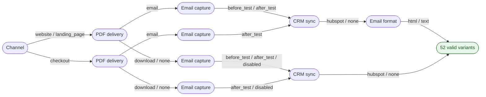
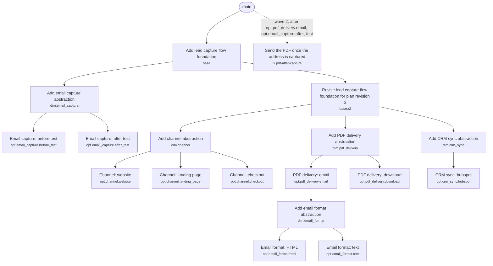

# Lead capture flow

_Why choose a product path when you can implement the whole decision space?_

## Intent

Visitors take a short self-assessment test and we turn them into leads. Nobody has decided yet where the flow lives, how the PDF report is delivered, when we ask for the email address, or whether leads go to HubSpot. Instead of waiting for a decision, we plan all of it.

## Review notes

- `crm_sync = hubspot` with `email_capture = disabled` creates HubSpot contacts without an email
  address. Is that useful, or should it be a constraint? (open question)
- `website` and `landing_page` probably share one flow and differ in layout. If so,
  `bundle: true` on `channel` saves two MRs.

## Spec

The canonical decision space. Edit it directly or describe the change in conversation; either way the plan below is regenerated from it.

```yaml cad-spec
# Revision 2 of the lead-capture example: emails can be HTML or plain text,
# and sending the PDF after capture needs a little glue code.
project: lead-capture-flow

dimensions:
  channel:
    - website
    - landing_page
    - checkout

  pdf_delivery:
    - email
    - download
    - none

  email_capture:
    - before_test
    - after_test
    - disabled

  crm_sync:
    - hubspot
    - none

  email_format:
    options: [html, text]
    applies_when: pdf_delivery == email

constraints:
  - if: pdf_delivery == email
    requires: email_capture != disabled

  - if: channel == checkout
    excludes: email_capture == before_test

interactions:
  - id: pdf-after-capture
    when: pdf_delivery == email and email_capture == after_test
    title: Send the PDF once the address is captured

generation:
  mode: exhaustive

limits:
  max_variants: 20
```

<!-- cad:generated:start (edit the spec above and run `cad.py render`; changes below this line are overwritten) -->

## Decision space

| | Count |
|---|---:|
| Theoretical combinations (3 × 3 × 3 × 2 × 2) | 108 |
| Collapsed, a decision does not apply | 36 |
| Removed by constraints | 20 |
| **Valid product variants** | **52** |
| Test scenarios (exhaustive) | 52 |
| Implementation nodes (MRs) | 18 |

**Needs confirmation:**
- 52 targeted variants exceed max_variants (20).

Options: proceed as planned, switch the test matrix to pairwise, add a constraint that rules out combinations nobody wants, raise limits.max_variants on purpose.

### Decision tree



Every path from left to right is one valid variant. Branches with identical continuations are merged, so all 52 variants fit in one small diagram.

### Dimensions

| Dimension | Options | Applies when |
|---|---|---|
| Channel (`channel`) | `website`, `landing_page`, `checkout` | always |
| PDF delivery (`pdf_delivery`) | `email`, `download`, `none` (no-op) | always |
| Email capture (`email_capture`) | `before_test`, `after_test`, `disabled` (no-op) | always |
| CRM sync (`crm_sync`) | `hubspot`, `none` (no-op) | always |
| Email format (`email_format`) | `html`, `text` | `pdf_delivery == email` |

### Constraints

| ID | Rule | Removes | Only this rule | Note |
|---|---|---:|---:|---|
| C1 | `if pdf_delivery == email requires email_capture != disabled` | 12 | 12 |  |
| C2 | `if channel == checkout excludes email_capture == before_test` | 8 | 8 |  |

### Findings

- **info**: `ix.pdf-after-capture` starts from main in wave 2 after `opt.pdf_delivery.email`, `opt.email_capture.after_test` merged (dependencies sit on separate lanes).
- **warning**: No `verify.probe` configured: nothing proves that each option actually changes the product. Green tests per branch are not enough (see references/verification.md).

## Implementation plan

18 nodes: 1 foundation, 5 abstractions, 10 options, 1 interaction, 1 follow-up. Work is planned per option, so 52 of 52 valid variants are configurable from 15 option and abstraction MRs.

### MR stack



| # | Node | Branch | Onto |
|---:|---|---|---|
| 1 | `base` | `lead-capture-flow/base` | `main` |
| 2 | `dim.email_capture` | `lead-capture-flow/email-capture` | `lead-capture-flow/base` |
| 3 | `opt.email_capture.before_test` | `lead-capture-flow/email-capture-before-test` | `lead-capture-flow/email-capture` |
| 4 | `opt.email_capture.after_test` | `lead-capture-flow/email-capture-after-test` | `lead-capture-flow/email-capture` |
| 5 | `base.r2` | `lead-capture-flow/base-r2` | `lead-capture-flow/base` |
| 6 | `dim.channel` | `lead-capture-flow/channel` | `lead-capture-flow/base-r2` |
| 7 | `dim.pdf_delivery` | `lead-capture-flow/pdf-delivery` | `lead-capture-flow/base-r2` |
| 8 | `dim.crm_sync` | `lead-capture-flow/crm-sync` | `lead-capture-flow/base-r2` |
| 9 | `opt.channel.website` | `lead-capture-flow/channel-website` | `lead-capture-flow/channel` |
| 10 | `opt.channel.landing_page` | `lead-capture-flow/channel-landing-page` | `lead-capture-flow/channel` |
| 11 | `opt.channel.checkout` | `lead-capture-flow/channel-checkout` | `lead-capture-flow/channel` |
| 12 | `opt.pdf_delivery.email` | `lead-capture-flow/pdf-delivery-email` | `lead-capture-flow/pdf-delivery` |
| 13 | `dim.email_format` | `lead-capture-flow/email-format` | `lead-capture-flow/pdf-delivery-email` |
| 14 | `opt.pdf_delivery.download` | `lead-capture-flow/pdf-delivery-download` | `lead-capture-flow/pdf-delivery` |
| 15 | `opt.crm_sync.hubspot` | `lead-capture-flow/crm-sync-hubspot` | `lead-capture-flow/crm-sync` |
| 16 | `opt.email_format.html` | `lead-capture-flow/email-format-html` | `lead-capture-flow/email-format` |
| 17 | `opt.email_format.text` | `lead-capture-flow/email-format-text` | `lead-capture-flow/email-format` |
| 18 | `ix.pdf-after-capture` | `lead-capture-flow/pdf-after-capture` | `main` (wave 2) |

Layout: tree. Merge order is the table order. Progress lives in git; `cad.py stack` shows what exists and what comes next.

### Nodes

<details><summary><b>1. Add lead capture flow foundation</b> <code>base</code></summary>

Shared domain model, configuration entry point and wiring that every variant builds on.

| | |
|---|---|
| Decisions | `shared by all variants` |
| Scope | Domain types, one configuration object with a key per dimension, validation of that configuration against the constraints, and the composition root that picks implementations. |
| Depends on | nothing (starts the stack) |
| Components | _to fill in from the repository_ |
| Expected files | _to fill in from the repository_ |
| Risk / complexity | medium / M |
| Branch | `lead-capture-flow/base` onto `main` |

**Guidance.** Prefer one configuration object over scattered flags. Validate it at startup with the same rules as the constraint table, so an invalid combination fails fast and loudly. Own the composition root here and let it discover option modules at runtime, so parallel option branches never touch the same file. Add the probe now: it proves later that every option is wired in.

**Tests**
- Unit tests for the domain model.
- Configuration tests: every combination removed by a constraint is rejected with a readable message.
- Scenarios: T01, T02, T03, T04, T05, T06, T07, T08 and 44 more

**Acceptance criteria**
- [ ] Configuration accepts the 52 valid variants and rejects the 20 invalid combinations.
- [ ] Existing behavior is unchanged while no variation point is wired in.
- [ ] The composition root discovers option modules at runtime, so option branches never edit shared files.
- [ ] Every active option leaves a marker in the output (for example `data-cad="style=serious"`), and the `verify.probe` command prints the markers it observes as `dimension=option`.

**MR description**

```markdown
## Summary
- Shared domain model, configuration entry point and wiring that every variant builds on.
- Part of the Lead capture flow decision space (examples/lead-capture-flow-r2.md), node `base`.

## Stack
- Based on `main`.
- Unblocks `lead-capture-flow/email-capture`, `lead-capture-flow/base-r2`.

## Verification
- Not run yet.
- Scenarios to cover: T01, T02, T03, T04, T05, T06, T07, T08 and 44 more.

## Risks
- Medium: Touches wiring shared by every variant.
```

</details>

<details><summary><b>2. Add email capture abstraction</b> <code>dim.email_capture</code></summary>

Variation point for email capture: one interface and one configuration key `email_capture`, so every option plugs in without touching callers.

| | |
|---|---|
| Decisions | `email_capture in [before_test, after_test, disabled]` |
| Scope | Interface for email capture, registration by option id, and the no-op implementation for `disabled`. |
| Depends on | `base` |
| Components | _to fill in from the repository_ |
| Expected files | _to fill in from the repository_ |
| Risk / complexity | medium / M |
| Branch | `lead-capture-flow/email-capture` onto `lead-capture-flow/base` |

**Guidance.** Use a strategy (or equivalent) keyed by option id. Keep today's behavior as the default. A no-op option is a real implementation of the interface; keep if-statements out of the call sites.

**Tests**
- Contract test suite that every implementation of the interface must pass.
- The no-op option `disabled` passes the contract suite.
- Scenarios: T01, T02, T03, T04, T05, T06, T07, T08 and 44 more

**Acceptance criteria**
- [ ] Selecting any of before_test, after_test, disabled through configuration works without code changes in callers.
- [ ] The selected `email_capture` option is observable in the output, no-op options included (for example `email_capture=disabled`).

**MR description**

```markdown
## Summary
- Variation point for email capture: one interface and one configuration key `email_capture`, so every option plugs in without touching callers.
- Decisions: `email_capture in [before_test, after_test, disabled]`
- Part of the Lead capture flow decision space (examples/lead-capture-flow-r2.md), node `dim.email_capture`.

## Stack
- Based on `lead-capture-flow/base` (Add lead capture flow foundation). Merge that first.
- Unblocks `lead-capture-flow/email-capture-before-test`, `lead-capture-flow/email-capture-after-test`.

## Verification
- Not run yet.
- Scenarios to cover: T01, T02, T03, T04, T05, T06, T07, T08 and 44 more.

## Risks
- Medium: Every option of this dimension builds on the interface introduced here.
```

</details>

<details><summary><b>3. Email capture: before test</b> <code>opt.email_capture.before_test</code></summary>

Implement `email_capture = before_test` behind the email capture abstraction.

| | |
|---|---|
| Decisions | `email_capture = before_test` |
| Scope | One implementation of the email capture interface, registered as `before_test`. No changes to other options. |
| Depends on | `dim.email_capture` |
| Components | _to fill in from the repository_ |
| Expected files | _to fill in from the repository_ |
| Risk / complexity | medium / S |
| Branch | `lead-capture-flow/email-capture-before-test` onto `lead-capture-flow/email-capture` |

**Guidance.** Touch only the new implementation and its registration. If the interface has to change, that change belongs in the abstraction node.

**Tests**
- Unit tests for the `before_test` implementation.
- Run the contract suite from the abstraction against it.
- Scenarios: T01, T02, T03, T04, T09, T10, T15, T16 and 8 more

**Acceptance criteria**
- [ ] All 16 test scenarios with email_capture = before_test pass.
- [ ] The probe observes `email_capture=before_test` in exactly the scenarios that select it (`cad.py verify --probe`).

**MR description**

```markdown
## Summary
- Implement `email_capture = before_test` behind the email capture abstraction.
- Decisions: `email_capture = before_test`
- Part of the Lead capture flow decision space (examples/lead-capture-flow-r2.md), node `opt.email_capture.before_test`.

## Stack
- Based on `lead-capture-flow/email-capture` (Add email capture abstraction). Merge that first.

## Verification
- Not run yet.
- Scenarios to cover: T01, T02, T03, T04, T09, T10, T15, T16 and 8 more.

## Risks
- Medium: Isolated to one option behind an interface.
```

</details>

<details><summary><b>4. Email capture: after test</b> <code>opt.email_capture.after_test</code></summary>

Implement `email_capture = after_test` behind the email capture abstraction.

| | |
|---|---|
| Decisions | `email_capture = after_test` |
| Scope | One implementation of the email capture interface, registered as `after_test`. No changes to other options. |
| Depends on | `dim.email_capture` |
| Components | _to fill in from the repository_ |
| Expected files | _to fill in from the repository_ |
| Risk / complexity | medium / S |
| Branch | `lead-capture-flow/email-capture-after-test` onto `lead-capture-flow/email-capture` |

**Guidance.** Touch only the new implementation and its registration. If the interface has to change, that change belongs in the abstraction node.

**Tests**
- Unit tests for the `after_test` implementation.
- Run the contract suite from the abstraction against it.
- Scenarios: T05, T06, T07, T08, T11, T12, T17, T18 and 16 more

**Acceptance criteria**
- [ ] All 24 test scenarios with email_capture = after_test pass.
- [ ] The probe observes `email_capture=after_test` in exactly the scenarios that select it (`cad.py verify --probe`).

**MR description**

```markdown
## Summary
- Implement `email_capture = after_test` behind the email capture abstraction.
- Decisions: `email_capture = after_test`
- Part of the Lead capture flow decision space (examples/lead-capture-flow-r2.md), node `opt.email_capture.after_test`.

## Stack
- Based on `lead-capture-flow/email-capture` (Add email capture abstraction). Merge that first.

## Verification
- Not run yet.
- Scenarios to cover: T05, T06, T07, T08, T11, T12, T17, T18 and 16 more.

## Risks
- Medium: Isolated to one option behind an interface.
```

</details>

<details><summary><b>5. Revise lead capture flow foundation for plan revision 2</b> <code>base.r2</code></summary>

`base` is already merged and its contract changed in plan revision 2. This node brings it in line without rewriting merged history.

| | |
|---|---|
| Decisions | `shared by all variants` |
| Scope | Only the listed contract changes. No unrelated refactoring. |
| Depends on | `base` |
| Components | _to fill in from the repository_ |
| Expected files | _to fill in from the repository_ |
| Risk / complexity | medium / S |
| Branch | `lead-capture-flow/base-r2` onto `lead-capture-flow/base` |

**Guidance.** Change only what the contract changes list. The original node is merged, so this is a normal new commit on top of the base branch; never rewrite merged history.

**Contract changes**
- `+ options: email_format: html, text`

**Tests**
- Unit tests for the domain model.
- Configuration tests: every combination removed by a constraint is rejected with a readable message.
- Scenarios: T01, T02, T03, T04, T05, T06, T07, T08 and 44 more

**Acceptance criteria**
- [ ] Contract change done: + options: email_format: html, text
- [ ] Everything `base` promised before still holds.

**MR description**

```markdown
## Summary
- `base` is already merged and its contract changed in plan revision 2. This node brings it in line without rewriting merged history.
- Decisions: `shared by all variants`
- Part of the Lead capture flow decision space (examples/lead-capture-flow-r2.md), node `base.r2`.

## Stack
- Based on `lead-capture-flow/base` (Add lead capture flow foundation). Merge that first.
- Unblocks `lead-capture-flow/channel`, `lead-capture-flow/pdf-delivery`, `lead-capture-flow/crm-sync`.

## Verification
- Not run yet.
- Scenarios to cover: T01, T02, T03, T04, T05, T06, T07, T08 and 44 more.

## Risks
- Medium: Changes code that is already merged and that other nodes build on.
```

</details>

<details><summary><b>6. Add channel abstraction</b> <code>dim.channel</code></summary>

Variation point for channel: one interface and one configuration key `channel`, so every option plugs in without touching callers.

| | |
|---|---|
| Decisions | `channel in [website, landing_page, checkout]` |
| Scope | Interface for channel, registration by option id. |
| Depends on | `base.r2` |
| Why | `base.r2`: builds on the updated `base` |
| Components | _to fill in from the repository_ |
| Expected files | _to fill in from the repository_ |
| Risk / complexity | medium / M |
| Branch | `lead-capture-flow/channel` onto `lead-capture-flow/base-r2` |

**Guidance.** Use a strategy (or equivalent) keyed by option id. Keep today's behavior as the default. A no-op option is a real implementation of the interface; keep if-statements out of the call sites.

**Tests**
- Contract test suite that every implementation of the interface must pass.
- Scenarios: T01, T02, T03, T04, T05, T06, T07, T08 and 44 more

**Acceptance criteria**
- [ ] Selecting any of website, landing_page, checkout through configuration works without code changes in callers.
- [ ] The selected `channel` option is observable in the output, no-op options included (for example `channel=checkout`).

**MR description**

```markdown
## Summary
- Variation point for channel: one interface and one configuration key `channel`, so every option plugs in without touching callers.
- Decisions: `channel in [website, landing_page, checkout]`
- Part of the Lead capture flow decision space (examples/lead-capture-flow-r2.md), node `dim.channel`.

## Stack
- Based on `lead-capture-flow/base-r2` (Revise lead capture flow foundation for plan revision 2). Merge that first.
- Unblocks `lead-capture-flow/channel-website`, `lead-capture-flow/channel-landing-page`, `lead-capture-flow/channel-checkout`.

## Verification
- Not run yet.
- Scenarios to cover: T01, T02, T03, T04, T05, T06, T07, T08 and 44 more.

## Risks
- Medium: Every option of this dimension builds on the interface introduced here.
```

</details>

<details><summary><b>7. Add PDF delivery abstraction</b> <code>dim.pdf_delivery</code></summary>

Variation point for PDF delivery: one interface and one configuration key `pdf_delivery`, so every option plugs in without touching callers.

| | |
|---|---|
| Decisions | `pdf_delivery in [email, download, none]` |
| Scope | Interface for PDF delivery, registration by option id, and the no-op implementation for `none`. |
| Depends on | `base.r2` |
| Why | `base.r2`: builds on the updated `base` |
| Components | _to fill in from the repository_ |
| Expected files | _to fill in from the repository_ |
| Risk / complexity | medium / M |
| Branch | `lead-capture-flow/pdf-delivery` onto `lead-capture-flow/base-r2` |

**Guidance.** Use a strategy (or equivalent) keyed by option id. Keep today's behavior as the default. A no-op option is a real implementation of the interface; keep if-statements out of the call sites.

**Tests**
- Contract test suite that every implementation of the interface must pass.
- The no-op option `none` passes the contract suite.
- Scenarios: T01, T02, T03, T04, T05, T06, T07, T08 and 44 more

**Acceptance criteria**
- [ ] Selecting any of email, download, none through configuration works without code changes in callers.
- [ ] The selected `pdf_delivery` option is observable in the output, no-op options included (for example `pdf_delivery=none`).

**MR description**

```markdown
## Summary
- Variation point for PDF delivery: one interface and one configuration key `pdf_delivery`, so every option plugs in without touching callers.
- Decisions: `pdf_delivery in [email, download, none]`
- Part of the Lead capture flow decision space (examples/lead-capture-flow-r2.md), node `dim.pdf_delivery`.

## Stack
- Based on `lead-capture-flow/base-r2` (Revise lead capture flow foundation for plan revision 2). Merge that first.
- Unblocks `lead-capture-flow/pdf-delivery-email`, `lead-capture-flow/pdf-delivery-download`.

## Verification
- Not run yet.
- Scenarios to cover: T01, T02, T03, T04, T05, T06, T07, T08 and 44 more.

## Risks
- Medium: Every option of this dimension builds on the interface introduced here.
```

</details>

<details><summary><b>8. Add CRM sync abstraction</b> <code>dim.crm_sync</code></summary>

Variation point for CRM sync: one interface and one configuration key `crm_sync`, so every option plugs in without touching callers.

| | |
|---|---|
| Decisions | `crm_sync in [hubspot, none]` |
| Scope | Interface for CRM sync, registration by option id, and the no-op implementation for `none`. |
| Depends on | `base.r2` |
| Why | `base.r2`: builds on the updated `base` |
| Components | _to fill in from the repository_ |
| Expected files | _to fill in from the repository_ |
| Risk / complexity | low / S |
| Branch | `lead-capture-flow/crm-sync` onto `lead-capture-flow/base-r2` |

**Guidance.** Use a strategy (or equivalent) keyed by option id. Keep today's behavior as the default. A no-op option is a real implementation of the interface; keep if-statements out of the call sites.

**Tests**
- Contract test suite that every implementation of the interface must pass.
- The no-op option `none` passes the contract suite.
- Scenarios: T01, T02, T03, T04, T05, T06, T07, T08 and 44 more

**Acceptance criteria**
- [ ] Selecting any of hubspot, none through configuration works without code changes in callers.
- [ ] The selected `crm_sync` option is observable in the output, no-op options included (for example `crm_sync=none`).

**MR description**

```markdown
## Summary
- Variation point for CRM sync: one interface and one configuration key `crm_sync`, so every option plugs in without touching callers.
- Decisions: `crm_sync in [hubspot, none]`
- Part of the Lead capture flow decision space (examples/lead-capture-flow-r2.md), node `dim.crm_sync`.

## Stack
- Based on `lead-capture-flow/base-r2` (Revise lead capture flow foundation for plan revision 2). Merge that first.
- Unblocks `lead-capture-flow/crm-sync-hubspot`.

## Verification
- Not run yet.
- Scenarios to cover: T01, T02, T03, T04, T05, T06, T07, T08 and 44 more.

## Risks
- Low: Every option of this dimension builds on the interface introduced here.
```

</details>

<details><summary><b>9. Channel: website</b> <code>opt.channel.website</code></summary>

Implement `channel = website` behind the channel abstraction.

| | |
|---|---|
| Decisions | `channel = website` |
| Scope | One implementation of the channel interface, registered as `website`. No changes to other options. |
| Depends on | `dim.channel` |
| Components | _to fill in from the repository_ |
| Expected files | _to fill in from the repository_ |
| Risk / complexity | low / S |
| Branch | `lead-capture-flow/channel-website` onto `lead-capture-flow/channel` |

**Guidance.** Touch only the new implementation and its registration. If the interface has to change, that change belongs in the abstraction node.

**Tests**
- Unit tests for the `website` implementation.
- Run the contract suite from the abstraction against it.
- Scenarios: T01, T02, T03, T04, T05, T06, T07, T08 and 12 more

**Acceptance criteria**
- [ ] All 20 test scenarios with channel = website pass.
- [ ] The probe observes `channel=website` in exactly the scenarios that select it (`cad.py verify --probe`).

**MR description**

```markdown
## Summary
- Implement `channel = website` behind the channel abstraction.
- Decisions: `channel = website`
- Part of the Lead capture flow decision space (examples/lead-capture-flow-r2.md), node `opt.channel.website`.

## Stack
- Based on `lead-capture-flow/channel` (Add channel abstraction). Merge that first.

## Verification
- Not run yet.
- Scenarios to cover: T01, T02, T03, T04, T05, T06, T07, T08 and 12 more.

## Risks
- Low: Isolated to one option behind an interface.
```

</details>

<details><summary><b>10. Channel: landing page</b> <code>opt.channel.landing_page</code></summary>

Implement `channel = landing_page` behind the channel abstraction.

| | |
|---|---|
| Decisions | `channel = landing_page` |
| Scope | One implementation of the channel interface, registered as `landing_page`. No changes to other options. |
| Depends on | `dim.channel` |
| Components | _to fill in from the repository_ |
| Expected files | _to fill in from the repository_ |
| Risk / complexity | low / S |
| Branch | `lead-capture-flow/channel-landing-page` onto `lead-capture-flow/channel` |

**Guidance.** Touch only the new implementation and its registration. If the interface has to change, that change belongs in the abstraction node.

**Tests**
- Unit tests for the `landing_page` implementation.
- Run the contract suite from the abstraction against it.
- Scenarios: T21, T22, T23, T24, T25, T26, T27, T28 and 12 more

**Acceptance criteria**
- [ ] All 20 test scenarios with channel = landing_page pass.
- [ ] The probe observes `channel=landing_page` in exactly the scenarios that select it (`cad.py verify --probe`).

**MR description**

```markdown
## Summary
- Implement `channel = landing_page` behind the channel abstraction.
- Decisions: `channel = landing_page`
- Part of the Lead capture flow decision space (examples/lead-capture-flow-r2.md), node `opt.channel.landing_page`.

## Stack
- Based on `lead-capture-flow/channel` (Add channel abstraction). Merge that first.

## Verification
- Not run yet.
- Scenarios to cover: T21, T22, T23, T24, T25, T26, T27, T28 and 12 more.

## Risks
- Low: Isolated to one option behind an interface.
```

</details>

<details><summary><b>11. Channel: checkout</b> <code>opt.channel.checkout</code></summary>

Implement `channel = checkout` behind the channel abstraction.

| | |
|---|---|
| Decisions | `channel = checkout` |
| Scope | One implementation of the channel interface, registered as `checkout`. No changes to other options. |
| Depends on | `dim.channel` |
| Components | _to fill in from the repository_ |
| Expected files | _to fill in from the repository_ |
| Risk / complexity | medium / S |
| Branch | `lead-capture-flow/channel-checkout` onto `lead-capture-flow/channel` |

**Guidance.** Touch only the new implementation and its registration. If the interface has to change, that change belongs in the abstraction node.

**Tests**
- Unit tests for the `checkout` implementation.
- Run the contract suite from the abstraction against it.
- Scenarios: T41, T42, T43, T44, T45, T46, T47, T48 and 4 more

**Acceptance criteria**
- [ ] All 12 test scenarios with channel = checkout pass.
- [ ] The probe observes `channel=checkout` in exactly the scenarios that select it (`cad.py verify --probe`).

**MR description**

```markdown
## Summary
- Implement `channel = checkout` behind the channel abstraction.
- Decisions: `channel = checkout`
- Part of the Lead capture flow decision space (examples/lead-capture-flow-r2.md), node `opt.channel.checkout`.

## Stack
- Based on `lead-capture-flow/channel` (Add channel abstraction). Merge that first.

## Verification
- Not run yet.
- Scenarios to cover: T41, T42, T43, T44, T45, T46, T47, T48 and 4 more.

## Risks
- Medium: Isolated to one option behind an interface.
```

</details>

<details><summary><b>12. PDF delivery: email</b> <code>opt.pdf_delivery.email</code></summary>

Implement `pdf_delivery = email` behind the PDF delivery abstraction.

| | |
|---|---|
| Decisions | `pdf_delivery = email` |
| Scope | One implementation of the PDF delivery interface, registered as `email`. No changes to other options. |
| Depends on | `dim.pdf_delivery`, `dim.email_capture` |
| Why | `dim.email_capture`: constraint C1 (if pdf_delivery == email requires email_capture != disabled) |
| Components | _to fill in from the repository_ |
| Expected files | _to fill in from the repository_ |
| Risk / complexity | medium / M |
| Branch | `lead-capture-flow/pdf-delivery-email` onto `lead-capture-flow/pdf-delivery` |

**Guidance.** Touch only the new implementation and its registration. If the interface has to change, that change belongs in the abstraction node.

**Tests**
- Unit tests for the `email` implementation.
- Run the contract suite from the abstraction against it.
- Scenarios: T01, T02, T03, T04, T05, T06, T07, T08 and 12 more

**Acceptance criteria**
- [ ] All 20 test scenarios with pdf_delivery = email pass.
- [ ] The probe observes `pdf_delivery=email` in exactly the scenarios that select it (`cad.py verify --probe`).

**MR description**

```markdown
## Summary
- Implement `pdf_delivery = email` behind the PDF delivery abstraction.
- Decisions: `pdf_delivery = email`
- Part of the Lead capture flow decision space (examples/lead-capture-flow-r2.md), node `opt.pdf_delivery.email`.

## Stack
- Based on `lead-capture-flow/pdf-delivery` (Add PDF delivery abstraction). Merge that first.
- Unblocks `lead-capture-flow/email-format`.

## Verification
- Not run yet.
- Scenarios to cover: T01, T02, T03, T04, T05, T06, T07, T08 and 12 more.

## Risks
- Medium: Isolated to one option behind an interface.
```

</details>

<details><summary><b>13. Add email format abstraction</b> <code>dim.email_format</code></summary>

Variation point for email format: one interface and one configuration key `email_format`, so every option plugs in without touching callers.

| | |
|---|---|
| Decisions | `email_format in [html, text]` |
| Scope | Interface for email format, registration by option id. |
| Depends on | `opt.pdf_delivery.email` |
| Why | `opt.pdf_delivery.email`: email_format only applies when pdf_delivery == email; `base.r2`: builds on the updated `base` |
| Components | _to fill in from the repository_ |
| Expected files | _to fill in from the repository_ |
| Risk / complexity | medium / S |
| Branch | `lead-capture-flow/email-format` onto `lead-capture-flow/pdf-delivery-email` |

**Guidance.** Use a strategy (or equivalent) keyed by option id. Keep today's behavior as the default. A no-op option is a real implementation of the interface; keep if-statements out of the call sites.

**Tests**
- Contract test suite that every implementation of the interface must pass.
- Scenarios: T01, T02, T03, T04, T05, T06, T07, T08 and 12 more

**Acceptance criteria**
- [ ] Selecting any of html, text through configuration works without code changes in callers.
- [ ] The selected `email_format` option is observable in the output, no-op options included (for example `email_format=text`).

**MR description**

```markdown
## Summary
- Variation point for email format: one interface and one configuration key `email_format`, so every option plugs in without touching callers.
- Decisions: `email_format in [html, text]`
- Part of the Lead capture flow decision space (examples/lead-capture-flow-r2.md), node `dim.email_format`.

## Stack
- Based on `lead-capture-flow/pdf-delivery-email` (PDF delivery: email). Merge that first.
- Unblocks `lead-capture-flow/email-format-html`, `lead-capture-flow/email-format-text`.

## Verification
- Not run yet.
- Scenarios to cover: T01, T02, T03, T04, T05, T06, T07, T08 and 12 more.

## Risks
- Medium: Every option of this dimension builds on the interface introduced here.
```

</details>

<details><summary><b>14. PDF delivery: download</b> <code>opt.pdf_delivery.download</code></summary>

Implement `pdf_delivery = download` behind the PDF delivery abstraction.

| | |
|---|---|
| Decisions | `pdf_delivery = download` |
| Scope | One implementation of the PDF delivery interface, registered as `download`. No changes to other options. |
| Depends on | `dim.pdf_delivery` |
| Components | _to fill in from the repository_ |
| Expected files | _to fill in from the repository_ |
| Risk / complexity | low / S |
| Branch | `lead-capture-flow/pdf-delivery-download` onto `lead-capture-flow/pdf-delivery` |

**Guidance.** Touch only the new implementation and its registration. If the interface has to change, that change belongs in the abstraction node.

**Tests**
- Unit tests for the `download` implementation.
- Run the contract suite from the abstraction against it.
- Scenarios: T09, T10, T11, T12, T13, T14, T29, T30 and 8 more

**Acceptance criteria**
- [ ] All 16 test scenarios with pdf_delivery = download pass.
- [ ] The probe observes `pdf_delivery=download` in exactly the scenarios that select it (`cad.py verify --probe`).

**MR description**

```markdown
## Summary
- Implement `pdf_delivery = download` behind the PDF delivery abstraction.
- Decisions: `pdf_delivery = download`
- Part of the Lead capture flow decision space (examples/lead-capture-flow-r2.md), node `opt.pdf_delivery.download`.

## Stack
- Based on `lead-capture-flow/pdf-delivery` (Add PDF delivery abstraction). Merge that first.

## Verification
- Not run yet.
- Scenarios to cover: T09, T10, T11, T12, T13, T14, T29, T30 and 8 more.

## Risks
- Low: Isolated to one option behind an interface.
```

</details>

<details><summary><b>15. CRM sync: hubspot</b> <code>opt.crm_sync.hubspot</code></summary>

Implement `crm_sync = hubspot` behind the CRM sync abstraction.

| | |
|---|---|
| Decisions | `crm_sync = hubspot` |
| Scope | One implementation of the CRM sync interface, registered as `hubspot`. No changes to other options. |
| Depends on | `dim.crm_sync` |
| Components | _to fill in from the repository_ |
| Expected files | _to fill in from the repository_ |
| Risk / complexity | low / S |
| Branch | `lead-capture-flow/crm-sync-hubspot` onto `lead-capture-flow/crm-sync` |

**Guidance.** Touch only the new implementation and its registration. If the interface has to change, that change belongs in the abstraction node.

**Tests**
- Unit tests for the `hubspot` implementation.
- Run the contract suite from the abstraction against it.
- Scenarios: T01, T02, T05, T06, T09, T11, T13, T15 and 18 more

**Acceptance criteria**
- [ ] All 26 test scenarios with crm_sync = hubspot pass.
- [ ] The probe observes `crm_sync=hubspot` in exactly the scenarios that select it (`cad.py verify --probe`).

**MR description**

```markdown
## Summary
- Implement `crm_sync = hubspot` behind the CRM sync abstraction.
- Decisions: `crm_sync = hubspot`
- Part of the Lead capture flow decision space (examples/lead-capture-flow-r2.md), node `opt.crm_sync.hubspot`.

## Stack
- Based on `lead-capture-flow/crm-sync` (Add CRM sync abstraction). Merge that first.

## Verification
- Not run yet.
- Scenarios to cover: T01, T02, T05, T06, T09, T11, T13, T15 and 18 more.

## Risks
- Low: Isolated to one option behind an interface.
```

</details>

<details><summary><b>16. Email format: HTML</b> <code>opt.email_format.html</code></summary>

Implement `email_format = html` behind the email format abstraction.

| | |
|---|---|
| Decisions | `email_format = html` |
| Scope | One implementation of the email format interface, registered as `html`. No changes to other options. |
| Depends on | `dim.email_format` |
| Components | _to fill in from the repository_ |
| Expected files | _to fill in from the repository_ |
| Risk / complexity | low / S |
| Branch | `lead-capture-flow/email-format-html` onto `lead-capture-flow/email-format` |

**Guidance.** Touch only the new implementation and its registration. If the interface has to change, that change belongs in the abstraction node.

**Tests**
- Unit tests for the `html` implementation.
- Run the contract suite from the abstraction against it.
- Scenarios: T01, T03, T05, T07, T21, T23, T25, T27 and 2 more

**Acceptance criteria**
- [ ] All 10 test scenarios with email_format = html pass.
- [ ] The probe observes `email_format=html` in exactly the scenarios that select it (`cad.py verify --probe`).

**MR description**

```markdown
## Summary
- Implement `email_format = html` behind the email format abstraction.
- Decisions: `email_format = html`
- Part of the Lead capture flow decision space (examples/lead-capture-flow-r2.md), node `opt.email_format.html`.

## Stack
- Based on `lead-capture-flow/email-format` (Add email format abstraction). Merge that first.

## Verification
- Not run yet.
- Scenarios to cover: T01, T03, T05, T07, T21, T23, T25, T27 and 2 more.

## Risks
- Low: Isolated to one option behind an interface.
```

</details>

<details><summary><b>17. Email format: text</b> <code>opt.email_format.text</code></summary>

Implement `email_format = text` behind the email format abstraction.

| | |
|---|---|
| Decisions | `email_format = text` |
| Scope | One implementation of the email format interface, registered as `text`. No changes to other options. |
| Depends on | `dim.email_format` |
| Components | _to fill in from the repository_ |
| Expected files | _to fill in from the repository_ |
| Risk / complexity | low / S |
| Branch | `lead-capture-flow/email-format-text` onto `lead-capture-flow/email-format` |

**Guidance.** Touch only the new implementation and its registration. If the interface has to change, that change belongs in the abstraction node.

**Tests**
- Unit tests for the `text` implementation.
- Run the contract suite from the abstraction against it.
- Scenarios: T02, T04, T06, T08, T22, T24, T26, T28 and 2 more

**Acceptance criteria**
- [ ] All 10 test scenarios with email_format = text pass.
- [ ] The probe observes `email_format=text` in exactly the scenarios that select it (`cad.py verify --probe`).

**MR description**

```markdown
## Summary
- Implement `email_format = text` behind the email format abstraction.
- Decisions: `email_format = text`
- Part of the Lead capture flow decision space (examples/lead-capture-flow-r2.md), node `opt.email_format.text`.

## Stack
- Based on `lead-capture-flow/email-format` (Add email format abstraction). Merge that first.

## Verification
- Not run yet.
- Scenarios to cover: T02, T04, T06, T08, T22, T24, T26, T28 and 2 more.

## Risks
- Low: Isolated to one option behind an interface.
```

</details>

<details><summary><b>18. Send the PDF once the address is captured</b> <code>ix.pdf-after-capture</code></summary>

Glue code for variants where pdf_delivery == email and email_capture == after_test.

| | |
|---|---|
| Decisions | `pdf_delivery == email and email_capture == after_test` |
| Scope | Only the code that is needed because these options meet. Each option stays usable on its own. |
| Depends on | `opt.pdf_delivery.email`, `opt.email_capture.after_test` |
| Why | starts after `opt.pdf_delivery.email`, `opt.email_capture.after_test` merged, because they sit on separate lanes |
| Components | _to fill in from the repository_ |
| Expected files | _to fill in from the repository_ |
| Risk / complexity | high / M |
| Branch | `lead-capture-flow/pdf-after-capture` onto `main` (wave 2) |

**Guidance.** Keep the glue at the composition root or in a small coordinator, so each option still works without the other.

**Tests**
- Integration test that exercises the involved options together.
- Scenarios: T05, T06, T07, T08, T25, T26, T27, T28 and 4 more

**Acceptance criteria**
- [ ] All 12 test scenarios where pdf_delivery == email and email_capture == after_test pass.

**MR description**

```markdown
## Summary
- Glue code for variants where pdf_delivery == email and email_capture == after_test.
- Decisions: `pdf_delivery == email and email_capture == after_test`
- Part of the Lead capture flow decision space (examples/lead-capture-flow-r2.md), node `ix.pdf-after-capture`.

## Stack
- Based on `main` after `opt.pdf_delivery.email`, `opt.email_capture.after_test` merged.

## Verification
- Not run yet.
- Scenarios to cover: T05, T06, T07, T08, T25, T26, T27, T28 and 4 more.

## Risks
- High: Couples options; regressions only show up in combined scenarios.
```

</details>

## Test matrix

Mode: **exhaustive**, every valid variant is a test scenario.

> The test matrix contains every valid variant.

<details><summary>52 scenarios</summary>

| ID | `channel` | `pdf_delivery` | `email_capture` | `crm_sync` | `email_format` |
|---|---|---|---|---|---|
| T01 | `website` | `email` | `before_test` | `hubspot` | `html` |
| T02 | `website` | `email` | `before_test` | `hubspot` | `text` |
| T03 | `website` | `email` | `before_test` | `none` | `html` |
| T04 | `website` | `email` | `before_test` | `none` | `text` |
| T05 | `website` | `email` | `after_test` | `hubspot` | `html` |
| T06 | `website` | `email` | `after_test` | `hubspot` | `text` |
| T07 | `website` | `email` | `after_test` | `none` | `html` |
| T08 | `website` | `email` | `after_test` | `none` | `text` |
| T09 | `website` | `download` | `before_test` | `hubspot` | n/a |
| T10 | `website` | `download` | `before_test` | `none` | n/a |
| T11 | `website` | `download` | `after_test` | `hubspot` | n/a |
| T12 | `website` | `download` | `after_test` | `none` | n/a |
| T13 | `website` | `download` | `disabled` | `hubspot` | n/a |
| T14 | `website` | `download` | `disabled` | `none` | n/a |
| T15 | `website` | `none` | `before_test` | `hubspot` | n/a |
| T16 | `website` | `none` | `before_test` | `none` | n/a |
| T17 | `website` | `none` | `after_test` | `hubspot` | n/a |
| T18 | `website` | `none` | `after_test` | `none` | n/a |
| T19 | `website` | `none` | `disabled` | `hubspot` | n/a |
| T20 | `website` | `none` | `disabled` | `none` | n/a |
| T21 | `landing_page` | `email` | `before_test` | `hubspot` | `html` |
| T22 | `landing_page` | `email` | `before_test` | `hubspot` | `text` |
| T23 | `landing_page` | `email` | `before_test` | `none` | `html` |
| T24 | `landing_page` | `email` | `before_test` | `none` | `text` |
| T25 | `landing_page` | `email` | `after_test` | `hubspot` | `html` |
| T26 | `landing_page` | `email` | `after_test` | `hubspot` | `text` |
| T27 | `landing_page` | `email` | `after_test` | `none` | `html` |
| T28 | `landing_page` | `email` | `after_test` | `none` | `text` |
| T29 | `landing_page` | `download` | `before_test` | `hubspot` | n/a |
| T30 | `landing_page` | `download` | `before_test` | `none` | n/a |
| T31 | `landing_page` | `download` | `after_test` | `hubspot` | n/a |
| T32 | `landing_page` | `download` | `after_test` | `none` | n/a |
| T33 | `landing_page` | `download` | `disabled` | `hubspot` | n/a |
| T34 | `landing_page` | `download` | `disabled` | `none` | n/a |
| T35 | `landing_page` | `none` | `before_test` | `hubspot` | n/a |
| T36 | `landing_page` | `none` | `before_test` | `none` | n/a |
| T37 | `landing_page` | `none` | `after_test` | `hubspot` | n/a |
| T38 | `landing_page` | `none` | `after_test` | `none` | n/a |
| T39 | `landing_page` | `none` | `disabled` | `hubspot` | n/a |
| T40 | `landing_page` | `none` | `disabled` | `none` | n/a |
| T41 | `checkout` | `email` | `after_test` | `hubspot` | `html` |
| T42 | `checkout` | `email` | `after_test` | `hubspot` | `text` |
| T43 | `checkout` | `email` | `after_test` | `none` | `html` |
| T44 | `checkout` | `email` | `after_test` | `none` | `text` |
| T45 | `checkout` | `download` | `after_test` | `hubspot` | n/a |
| T46 | `checkout` | `download` | `after_test` | `none` | n/a |
| T47 | `checkout` | `download` | `disabled` | `hubspot` | n/a |
| T48 | `checkout` | `download` | `disabled` | `none` | n/a |
| T49 | `checkout` | `none` | `after_test` | `hubspot` | n/a |
| T50 | `checkout` | `none` | `after_test` | `none` | n/a |
| T51 | `checkout` | `none` | `disabled` | `hubspot` | n/a |
| T52 | `checkout` | `none` | `disabled` | `none` | n/a |

</details>

<!-- cad:generated:end -->

## Changelog
- **r2** (2026-09-28): Emails can be HTML or plain text. Sending the PDF after capture needs glue code.
  - Added: `base.r2`, `dim.email_format`, `opt.email_format.html`, `opt.email_format.text`, `ix.pdf-after-capture`.
  - Valid variants 42 to 52; test scenarios 42 to 52; nodes 13 to 18.
  - Follow-up planned: `base.r2`, because `base` is merged and its contract changed.
- **r1** (2026-09-23): Initial plan for the lead capture flow.

<!-- cad:contracts
base ["decision: shared by all variants", "scope: Domain types, one configuration object with a key per dimension, validation of that configuration against the constraints, and the composition root that picks implementations.", "accept: Configuration accepts the # valid variants and rejects the # invalid combinations.", "accept: Existing behavior is unchanged while no variation point is wired in.", "accept: The composition root discovers option modules at runtime, so option branches never edit shared files.", "accept: Every active option leaves a marker in the output (for example `data-cad=\"style=serious\"`), and the `verify.probe` command prints the markers it observes as `dimension=option`.", "rule: if pdf_delivery == email requires email_capture != disabled", "rule: if channel == checkout excludes email_capture == before_test", "options: channel: checkout, landing_page, website", "options: pdf_delivery: download, email, none", "options: email_capture: after_test, before_test, disabled", "options: crm_sync: hubspot, none", "options: email_format: html, text"]
dim.email_capture ["decision: email_capture in [before_test, after_test, disabled]", "depends on: base", "scope: Interface for email capture, registration by option id, and the no-op implementation for `disabled`.", "accept: Selecting any of before_test, after_test, disabled through configuration works without code changes in callers.", "accept: The selected `email_capture` option is observable in the output, no-op options included (for example `email_capture=disabled`)."]
opt.email_capture.after_test ["decision: email_capture = after_test", "depends on: dim.email_capture", "scope: One implementation of the email capture interface, registered as `after_test`. No changes to other options.", "accept: All # test scenarios with email_capture = after_test pass.", "accept: The probe observes `email_capture=after_test` in exactly the scenarios that select it (`cad.py verify --probe`)."]
-->
