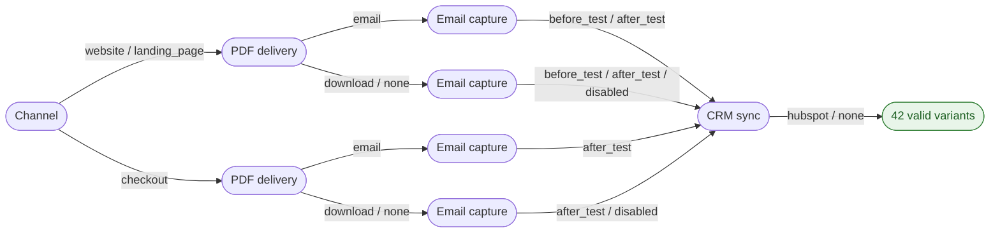

# Lead capture flow

_Why choose a product path when you can implement the whole decision space?_

## Intent

Visitors take a short self-assessment test and we turn them into leads. Nobody has decided yet where the flow lives, how the PDF report is delivered, when we ask for the email address, or whether leads go to HubSpot. Instead of waiting for a decision, we plan all of it.

## Review notes

- `crm_sync = hubspot` with `email_capture = disabled` creates HubSpot contacts without an email
  address. Is that useful, or should it be a constraint? (open question)
- `website` and `landing_page` probably share one flow and differ in layout. If so,
  `bundle: true` on `channel` saves two MRs.

## Spec

The canonical decision space. Edit it directly or describe the change in conversation; either way the plan below is regenerated from it.

```yaml cad-spec
project: lead-capture-flow

dimensions:
  channel:
    - website
    - landing_page
    - checkout

  pdf_delivery:
    - email
    - download
    - none

  email_capture:
    - before_test
    - after_test
    - disabled

  crm_sync:
    - hubspot
    - none

constraints:
  - if: pdf_delivery == email
    requires: email_capture != disabled

  - if: channel == checkout
    excludes: email_capture == before_test

generation:
  mode: exhaustive

limits:
  max_variants: 20
```

<!-- cad:generated:start (edit the spec above and run `cad.py render`; changes below this line are overwritten) -->

## Decision space

| | Count |
|---|---:|
| Theoretical combinations (3 × 3 × 3 × 2) | 54 |
| Removed by constraints | 12 |
| **Valid product variants** | **42** |
| Test scenarios (exhaustive) | 42 |
| Implementation nodes (MRs) | 13 |

**Needs confirmation:**
- 42 targeted variants exceed max_variants (20).

Options: proceed as planned, switch the test matrix to pairwise, add a constraint that rules out combinations nobody wants, raise limits.max_variants on purpose.

### Decision tree



Every path from left to right is one valid variant. Branches with identical continuations are merged, so all 42 variants fit in one small diagram.

### Dimensions

| Dimension | Options | Applies when |
|---|---|---|
| Channel (`channel`) | `website`, `landing_page`, `checkout` | always |
| PDF delivery (`pdf_delivery`) | `email`, `download`, `none` (no-op) | always |
| Email capture (`email_capture`) | `before_test`, `after_test`, `disabled` (no-op) | always |
| CRM sync (`crm_sync`) | `hubspot`, `none` (no-op) | always |

### Constraints

| ID | Rule | Removes | Only this rule | Note |
|---|---|---:|---:|---|
| C1 | `if pdf_delivery == email requires email_capture != disabled` | 6 | 6 |  |
| C2 | `if channel == checkout excludes email_capture == before_test` | 6 | 6 |  |

### Findings

- **warning**: No `verify.probe` configured: nothing proves that each option actually changes the product. Green tests per branch are not enough (see references/verification.md).

## Implementation plan

13 nodes: 1 foundation, 4 abstractions, 8 options, 0 interactions. Work is planned per option, so 42 of 42 valid variants are configurable from 12 option and abstraction MRs.

### MR stack

```mermaid
flowchart TD
  main(["main"])
  s_base["Add lead capture flow foundation<br/><small>base</small>"]
  s_dim_channel["Add channel abstraction<br/><small>dim.channel</small>"]
  s_dim_email_capture["Add email capture abstraction<br/><small>dim.email_capture</small>"]
  s_dim_pdf_delivery["Add PDF delivery abstraction<br/><small>dim.pdf_delivery</small>"]
  s_dim_crm_sync["Add CRM sync abstraction<br/><small>dim.crm_sync</small>"]
  s_opt_channel_website["Channel: website<br/><small>opt.channel.website</small>"]
  s_opt_channel_landing_page["Channel: landing page<br/><small>opt.channel.landing_page</small>"]
  s_opt_channel_checkout["Channel: checkout<br/><small>opt.channel.checkout</small>"]
  s_opt_pdf_delivery_email["PDF delivery: email<br/><small>opt.pdf_delivery.email</small>"]
  s_opt_pdf_delivery_download["PDF delivery: download<br/><small>opt.pdf_delivery.download</small>"]
  s_opt_email_capture_before_test["Email capture: before test<br/><small>opt.email_capture.before_test</small>"]
  s_opt_email_capture_after_test["Email capture: after test<br/><small>opt.email_capture.after_test</small>"]
  s_opt_crm_sync_hubspot["CRM sync: hubspot<br/><small>opt.crm_sync.hubspot</small>"]
  main --> s_base
  s_base --> s_dim_channel
  s_base --> s_dim_email_capture
  s_dim_email_capture --> s_dim_pdf_delivery
  s_base --> s_dim_crm_sync
  s_dim_channel --> s_opt_channel_website
  s_dim_channel --> s_opt_channel_landing_page
  s_dim_channel --> s_opt_channel_checkout
  s_dim_pdf_delivery --> s_opt_pdf_delivery_email
  s_dim_pdf_delivery --> s_opt_pdf_delivery_download
  s_dim_email_capture --> s_opt_email_capture_before_test
  s_dim_email_capture --> s_opt_email_capture_after_test
  s_dim_crm_sync --> s_opt_crm_sync_hubspot
```



| # | Node | Branch | Onto |
|---:|---|---|---|
| 1 | `base` | `lead-capture-flow/base` | `main` |
| 2 | `dim.channel` | `lead-capture-flow/channel` | `lead-capture-flow/base` |
| 3 | `dim.email_capture` | `lead-capture-flow/email-capture` | `lead-capture-flow/base` |
| 4 | `dim.pdf_delivery` | `lead-capture-flow/pdf-delivery` | `lead-capture-flow/email-capture` |
| 5 | `dim.crm_sync` | `lead-capture-flow/crm-sync` | `lead-capture-flow/base` |
| 6 | `opt.channel.website` | `lead-capture-flow/channel-website` | `lead-capture-flow/channel` |
| 7 | `opt.channel.landing_page` | `lead-capture-flow/channel-landing-page` | `lead-capture-flow/channel` |
| 8 | `opt.channel.checkout` | `lead-capture-flow/channel-checkout` | `lead-capture-flow/channel` |
| 9 | `opt.pdf_delivery.email` | `lead-capture-flow/pdf-delivery-email` | `lead-capture-flow/pdf-delivery` |
| 10 | `opt.pdf_delivery.download` | `lead-capture-flow/pdf-delivery-download` | `lead-capture-flow/pdf-delivery` |
| 11 | `opt.email_capture.before_test` | `lead-capture-flow/email-capture-before-test` | `lead-capture-flow/email-capture` |
| 12 | `opt.email_capture.after_test` | `lead-capture-flow/email-capture-after-test` | `lead-capture-flow/email-capture` |
| 13 | `opt.crm_sync.hubspot` | `lead-capture-flow/crm-sync-hubspot` | `lead-capture-flow/crm-sync` |

Layout: tree. Merge order is the table order. Progress lives in git; `cad.py stack` shows what exists and what comes next.

### Nodes

<details><summary><b>1. Add lead capture flow foundation</b> <code>base</code></summary>

Shared domain model, configuration entry point and wiring that every variant builds on.

| | |
|---|---|
| Decisions | `shared by all variants` |
| Scope | Domain types, one configuration object with a key per dimension, validation of that configuration against the constraints, and the composition root that picks implementations. |
| Depends on | nothing (starts the stack) |
| Components | _to fill in from the repository_ |
| Expected files | _to fill in from the repository_ |
| Risk / complexity | medium / M |
| Branch | `lead-capture-flow/base` onto `main` |

**Guidance.** Prefer one configuration object over scattered flags. Validate it at startup with the same rules as the constraint table, so an invalid combination fails fast and loudly. Own the composition root here and let it discover option modules at runtime, so parallel option branches never touch the same file. Add the probe now: it proves later that every option is wired in.

**Tests**
- Unit tests for the domain model.
- Configuration tests: every combination removed by a constraint is rejected with a readable message.
- Scenarios: T01, T02, T03, T04, T05, T06, T07, T08 and 34 more

**Acceptance criteria**
- [ ] Configuration accepts the 42 valid variants and rejects the 12 invalid combinations.
- [ ] Existing behavior is unchanged while no variation point is wired in.
- [ ] The composition root discovers option modules at runtime, so option branches never edit shared files.
- [ ] Every active option leaves a marker in the output (for example `data-cad="style=serious"`), and the `verify.probe` command prints the markers it observes as `dimension=option`.

**MR description**

```markdown
## Summary
- Shared domain model, configuration entry point and wiring that every variant builds on.
- Part of the Lead capture flow decision space (examples/lead-capture-flow.md), node `base`.

## Stack
- Based on `main`.
- Unblocks `lead-capture-flow/channel`, `lead-capture-flow/email-capture`, `lead-capture-flow/crm-sync`.

## Verification
- Not run yet.
- Scenarios to cover: T01, T02, T03, T04, T05, T06, T07, T08 and 34 more.

## Risks
- Medium: Touches wiring shared by every variant.
```

</details>

<details><summary><b>2. Add channel abstraction</b> <code>dim.channel</code></summary>

Variation point for channel: one interface and one configuration key `channel`, so every option plugs in without touching callers.

| | |
|---|---|
| Decisions | `channel in [website, landing_page, checkout]` |
| Scope | Interface for channel, registration by option id. |
| Depends on | `base` |
| Components | _to fill in from the repository_ |
| Expected files | _to fill in from the repository_ |
| Risk / complexity | medium / M |
| Branch | `lead-capture-flow/channel` onto `lead-capture-flow/base` |

**Guidance.** Use a strategy (or equivalent) keyed by option id. Keep today's behavior as the default. A no-op option is a real implementation of the interface; keep if-statements out of the call sites.

**Tests**
- Contract test suite that every implementation of the interface must pass.
- Scenarios: T01, T02, T03, T04, T05, T06, T07, T08 and 34 more

**Acceptance criteria**
- [ ] Selecting any of website, landing_page, checkout through configuration works without code changes in callers.
- [ ] The selected `channel` option is observable in the output, no-op options included (for example `channel=checkout`).

**MR description**

```markdown
## Summary
- Variation point for channel: one interface and one configuration key `channel`, so every option plugs in without touching callers.
- Decisions: `channel in [website, landing_page, checkout]`
- Part of the Lead capture flow decision space (examples/lead-capture-flow.md), node `dim.channel`.

## Stack
- Based on `lead-capture-flow/base` (Add lead capture flow foundation). Merge that first.
- Unblocks `lead-capture-flow/channel-website`, `lead-capture-flow/channel-landing-page`, `lead-capture-flow/channel-checkout`.

## Verification
- Not run yet.
- Scenarios to cover: T01, T02, T03, T04, T05, T06, T07, T08 and 34 more.

## Risks
- Medium: Every option of this dimension builds on the interface introduced here.
```

</details>

<details><summary><b>3. Add email capture abstraction</b> <code>dim.email_capture</code></summary>

Variation point for email capture: one interface and one configuration key `email_capture`, so every option plugs in without touching callers.

| | |
|---|---|
| Decisions | `email_capture in [before_test, after_test, disabled]` |
| Scope | Interface for email capture, registration by option id, and the no-op implementation for `disabled`. |
| Depends on | `base` |
| Components | _to fill in from the repository_ |
| Expected files | _to fill in from the repository_ |
| Risk / complexity | medium / M |
| Branch | `lead-capture-flow/email-capture` onto `lead-capture-flow/base` |

**Guidance.** Use a strategy (or equivalent) keyed by option id. Keep today's behavior as the default. A no-op option is a real implementation of the interface; keep if-statements out of the call sites.

**Tests**
- Contract test suite that every implementation of the interface must pass.
- The no-op option `disabled` passes the contract suite.
- Scenarios: T01, T02, T03, T04, T05, T06, T07, T08 and 34 more

**Acceptance criteria**
- [ ] Selecting any of before_test, after_test, disabled through configuration works without code changes in callers.
- [ ] The selected `email_capture` option is observable in the output, no-op options included (for example `email_capture=disabled`).

**MR description**

```markdown
## Summary
- Variation point for email capture: one interface and one configuration key `email_capture`, so every option plugs in without touching callers.
- Decisions: `email_capture in [before_test, after_test, disabled]`
- Part of the Lead capture flow decision space (examples/lead-capture-flow.md), node `dim.email_capture`.

## Stack
- Based on `lead-capture-flow/base` (Add lead capture flow foundation). Merge that first.
- Unblocks `lead-capture-flow/pdf-delivery`, `lead-capture-flow/email-capture-before-test`, `lead-capture-flow/email-capture-after-test`.

## Verification
- Not run yet.
- Scenarios to cover: T01, T02, T03, T04, T05, T06, T07, T08 and 34 more.

## Risks
- Medium: Every option of this dimension builds on the interface introduced here.
```

</details>

<details><summary><b>4. Add PDF delivery abstraction</b> <code>dim.pdf_delivery</code></summary>

Variation point for PDF delivery: one interface and one configuration key `pdf_delivery`, so every option plugs in without touching callers.

| | |
|---|---|
| Decisions | `pdf_delivery in [email, download, none]` |
| Scope | Interface for PDF delivery, registration by option id, and the no-op implementation for `none`. |
| Depends on | `base` |
| Why | stacked on `dim.email_capture` so that `opt.pdf_delivery.email` can build on both |
| Components | _to fill in from the repository_ |
| Expected files | _to fill in from the repository_ |
| Risk / complexity | medium / M |
| Branch | `lead-capture-flow/pdf-delivery` onto `lead-capture-flow/email-capture` |

**Guidance.** Use a strategy (or equivalent) keyed by option id. Keep today's behavior as the default. A no-op option is a real implementation of the interface; keep if-statements out of the call sites.

**Tests**
- Contract test suite that every implementation of the interface must pass.
- The no-op option `none` passes the contract suite.
- Scenarios: T01, T02, T03, T04, T05, T06, T07, T08 and 34 more

**Acceptance criteria**
- [ ] Selecting any of email, download, none through configuration works without code changes in callers.
- [ ] The selected `pdf_delivery` option is observable in the output, no-op options included (for example `pdf_delivery=none`).

**MR description**

```markdown
## Summary
- Variation point for PDF delivery: one interface and one configuration key `pdf_delivery`, so every option plugs in without touching callers.
- Decisions: `pdf_delivery in [email, download, none]`
- Part of the Lead capture flow decision space (examples/lead-capture-flow.md), node `dim.pdf_delivery`.

## Stack
- Based on `lead-capture-flow/email-capture` (Add email capture abstraction). Merge that first.
- Unblocks `lead-capture-flow/pdf-delivery-email`, `lead-capture-flow/pdf-delivery-download`.

## Verification
- Not run yet.
- Scenarios to cover: T01, T02, T03, T04, T05, T06, T07, T08 and 34 more.

## Risks
- Medium: Every option of this dimension builds on the interface introduced here.
```

</details>

<details><summary><b>5. Add CRM sync abstraction</b> <code>dim.crm_sync</code></summary>

Variation point for CRM sync: one interface and one configuration key `crm_sync`, so every option plugs in without touching callers.

| | |
|---|---|
| Decisions | `crm_sync in [hubspot, none]` |
| Scope | Interface for CRM sync, registration by option id, and the no-op implementation for `none`. |
| Depends on | `base` |
| Components | _to fill in from the repository_ |
| Expected files | _to fill in from the repository_ |
| Risk / complexity | low / S |
| Branch | `lead-capture-flow/crm-sync` onto `lead-capture-flow/base` |

**Guidance.** Use a strategy (or equivalent) keyed by option id. Keep today's behavior as the default. A no-op option is a real implementation of the interface; keep if-statements out of the call sites.

**Tests**
- Contract test suite that every implementation of the interface must pass.
- The no-op option `none` passes the contract suite.
- Scenarios: T01, T02, T03, T04, T05, T06, T07, T08 and 34 more

**Acceptance criteria**
- [ ] Selecting any of hubspot, none through configuration works without code changes in callers.
- [ ] The selected `crm_sync` option is observable in the output, no-op options included (for example `crm_sync=none`).

**MR description**

```markdown
## Summary
- Variation point for CRM sync: one interface and one configuration key `crm_sync`, so every option plugs in without touching callers.
- Decisions: `crm_sync in [hubspot, none]`
- Part of the Lead capture flow decision space (examples/lead-capture-flow.md), node `dim.crm_sync`.

## Stack
- Based on `lead-capture-flow/base` (Add lead capture flow foundation). Merge that first.
- Unblocks `lead-capture-flow/crm-sync-hubspot`.

## Verification
- Not run yet.
- Scenarios to cover: T01, T02, T03, T04, T05, T06, T07, T08 and 34 more.

## Risks
- Low: Every option of this dimension builds on the interface introduced here.
```

</details>

<details><summary><b>6. Channel: website</b> <code>opt.channel.website</code></summary>

Implement `channel = website` behind the channel abstraction.

| | |
|---|---|
| Decisions | `channel = website` |
| Scope | One implementation of the channel interface, registered as `website`. No changes to other options. |
| Depends on | `dim.channel` |
| Components | _to fill in from the repository_ |
| Expected files | _to fill in from the repository_ |
| Risk / complexity | low / S |
| Branch | `lead-capture-flow/channel-website` onto `lead-capture-flow/channel` |

**Guidance.** Touch only the new implementation and its registration. If the interface has to change, that change belongs in the abstraction node.

**Tests**
- Unit tests for the `website` implementation.
- Run the contract suite from the abstraction against it.
- Scenarios: T01, T02, T03, T04, T05, T06, T07, T08 and 8 more

**Acceptance criteria**
- [ ] All 16 test scenarios with channel = website pass.
- [ ] The probe observes `channel=website` in exactly the scenarios that select it (`cad.py verify --probe`).

**MR description**

```markdown
## Summary
- Implement `channel = website` behind the channel abstraction.
- Decisions: `channel = website`
- Part of the Lead capture flow decision space (examples/lead-capture-flow.md), node `opt.channel.website`.

## Stack
- Based on `lead-capture-flow/channel` (Add channel abstraction). Merge that first.

## Verification
- Not run yet.
- Scenarios to cover: T01, T02, T03, T04, T05, T06, T07, T08 and 8 more.

## Risks
- Low: Isolated to one option behind an interface.
```

</details>

<details><summary><b>7. Channel: landing page</b> <code>opt.channel.landing_page</code></summary>

Implement `channel = landing_page` behind the channel abstraction.

| | |
|---|---|
| Decisions | `channel = landing_page` |
| Scope | One implementation of the channel interface, registered as `landing_page`. No changes to other options. |
| Depends on | `dim.channel` |
| Components | _to fill in from the repository_ |
| Expected files | _to fill in from the repository_ |
| Risk / complexity | low / S |
| Branch | `lead-capture-flow/channel-landing-page` onto `lead-capture-flow/channel` |

**Guidance.** Touch only the new implementation and its registration. If the interface has to change, that change belongs in the abstraction node.

**Tests**
- Unit tests for the `landing_page` implementation.
- Run the contract suite from the abstraction against it.
- Scenarios: T17, T18, T19, T20, T21, T22, T23, T24 and 8 more

**Acceptance criteria**
- [ ] All 16 test scenarios with channel = landing_page pass.
- [ ] The probe observes `channel=landing_page` in exactly the scenarios that select it (`cad.py verify --probe`).

**MR description**

```markdown
## Summary
- Implement `channel = landing_page` behind the channel abstraction.
- Decisions: `channel = landing_page`
- Part of the Lead capture flow decision space (examples/lead-capture-flow.md), node `opt.channel.landing_page`.

## Stack
- Based on `lead-capture-flow/channel` (Add channel abstraction). Merge that first.

## Verification
- Not run yet.
- Scenarios to cover: T17, T18, T19, T20, T21, T22, T23, T24 and 8 more.

## Risks
- Low: Isolated to one option behind an interface.
```

</details>

<details><summary><b>8. Channel: checkout</b> <code>opt.channel.checkout</code></summary>

Implement `channel = checkout` behind the channel abstraction.

| | |
|---|---|
| Decisions | `channel = checkout` |
| Scope | One implementation of the channel interface, registered as `checkout`. No changes to other options. |
| Depends on | `dim.channel` |
| Components | _to fill in from the repository_ |
| Expected files | _to fill in from the repository_ |
| Risk / complexity | medium / S |
| Branch | `lead-capture-flow/channel-checkout` onto `lead-capture-flow/channel` |

**Guidance.** Touch only the new implementation and its registration. If the interface has to change, that change belongs in the abstraction node.

**Tests**
- Unit tests for the `checkout` implementation.
- Run the contract suite from the abstraction against it.
- Scenarios: T33, T34, T35, T36, T37, T38, T39, T40 and 2 more

**Acceptance criteria**
- [ ] All 10 test scenarios with channel = checkout pass.
- [ ] The probe observes `channel=checkout` in exactly the scenarios that select it (`cad.py verify --probe`).

**MR description**

```markdown
## Summary
- Implement `channel = checkout` behind the channel abstraction.
- Decisions: `channel = checkout`
- Part of the Lead capture flow decision space (examples/lead-capture-flow.md), node `opt.channel.checkout`.

## Stack
- Based on `lead-capture-flow/channel` (Add channel abstraction). Merge that first.

## Verification
- Not run yet.
- Scenarios to cover: T33, T34, T35, T36, T37, T38, T39, T40 and 2 more.

## Risks
- Medium: Isolated to one option behind an interface.
```

</details>

<details><summary><b>9. PDF delivery: email</b> <code>opt.pdf_delivery.email</code></summary>

Implement `pdf_delivery = email` behind the PDF delivery abstraction.

| | |
|---|---|
| Decisions | `pdf_delivery = email` |
| Scope | One implementation of the PDF delivery interface, registered as `email`. No changes to other options. |
| Depends on | `dim.pdf_delivery`, `dim.email_capture` |
| Why | `dim.email_capture`: constraint C1 (if pdf_delivery == email requires email_capture != disabled) |
| Components | _to fill in from the repository_ |
| Expected files | _to fill in from the repository_ |
| Risk / complexity | medium / S |
| Branch | `lead-capture-flow/pdf-delivery-email` onto `lead-capture-flow/pdf-delivery` |

**Guidance.** Touch only the new implementation and its registration. If the interface has to change, that change belongs in the abstraction node.

**Tests**
- Unit tests for the `email` implementation.
- Run the contract suite from the abstraction against it.
- Scenarios: T01, T02, T03, T04, T17, T18, T19, T20 and 2 more

**Acceptance criteria**
- [ ] All 10 test scenarios with pdf_delivery = email pass.
- [ ] The probe observes `pdf_delivery=email` in exactly the scenarios that select it (`cad.py verify --probe`).

**MR description**

```markdown
## Summary
- Implement `pdf_delivery = email` behind the PDF delivery abstraction.
- Decisions: `pdf_delivery = email`
- Part of the Lead capture flow decision space (examples/lead-capture-flow.md), node `opt.pdf_delivery.email`.

## Stack
- Based on `lead-capture-flow/pdf-delivery` (Add PDF delivery abstraction). Merge that first.

## Verification
- Not run yet.
- Scenarios to cover: T01, T02, T03, T04, T17, T18, T19, T20 and 2 more.

## Risks
- Medium: Isolated to one option behind an interface.
```

</details>

<details><summary><b>10. PDF delivery: download</b> <code>opt.pdf_delivery.download</code></summary>

Implement `pdf_delivery = download` behind the PDF delivery abstraction.

| | |
|---|---|
| Decisions | `pdf_delivery = download` |
| Scope | One implementation of the PDF delivery interface, registered as `download`. No changes to other options. |
| Depends on | `dim.pdf_delivery` |
| Components | _to fill in from the repository_ |
| Expected files | _to fill in from the repository_ |
| Risk / complexity | low / S |
| Branch | `lead-capture-flow/pdf-delivery-download` onto `lead-capture-flow/pdf-delivery` |

**Guidance.** Touch only the new implementation and its registration. If the interface has to change, that change belongs in the abstraction node.

**Tests**
- Unit tests for the `download` implementation.
- Run the contract suite from the abstraction against it.
- Scenarios: T05, T06, T07, T08, T09, T10, T21, T22 and 8 more

**Acceptance criteria**
- [ ] All 16 test scenarios with pdf_delivery = download pass.
- [ ] The probe observes `pdf_delivery=download` in exactly the scenarios that select it (`cad.py verify --probe`).

**MR description**

```markdown
## Summary
- Implement `pdf_delivery = download` behind the PDF delivery abstraction.
- Decisions: `pdf_delivery = download`
- Part of the Lead capture flow decision space (examples/lead-capture-flow.md), node `opt.pdf_delivery.download`.

## Stack
- Based on `lead-capture-flow/pdf-delivery` (Add PDF delivery abstraction). Merge that first.

## Verification
- Not run yet.
- Scenarios to cover: T05, T06, T07, T08, T09, T10, T21, T22 and 8 more.

## Risks
- Low: Isolated to one option behind an interface.
```

</details>

<details><summary><b>11. Email capture: before test</b> <code>opt.email_capture.before_test</code></summary>

Implement `email_capture = before_test` behind the email capture abstraction.

| | |
|---|---|
| Decisions | `email_capture = before_test` |
| Scope | One implementation of the email capture interface, registered as `before_test`. No changes to other options. |
| Depends on | `dim.email_capture` |
| Components | _to fill in from the repository_ |
| Expected files | _to fill in from the repository_ |
| Risk / complexity | medium / S |
| Branch | `lead-capture-flow/email-capture-before-test` onto `lead-capture-flow/email-capture` |

**Guidance.** Touch only the new implementation and its registration. If the interface has to change, that change belongs in the abstraction node.

**Tests**
- Unit tests for the `before_test` implementation.
- Run the contract suite from the abstraction against it.
- Scenarios: T01, T02, T05, T06, T11, T12, T17, T18 and 4 more

**Acceptance criteria**
- [ ] All 12 test scenarios with email_capture = before_test pass.
- [ ] The probe observes `email_capture=before_test` in exactly the scenarios that select it (`cad.py verify --probe`).

**MR description**

```markdown
## Summary
- Implement `email_capture = before_test` behind the email capture abstraction.
- Decisions: `email_capture = before_test`
- Part of the Lead capture flow decision space (examples/lead-capture-flow.md), node `opt.email_capture.before_test`.

## Stack
- Based on `lead-capture-flow/email-capture` (Add email capture abstraction). Merge that first.

## Verification
- Not run yet.
- Scenarios to cover: T01, T02, T05, T06, T11, T12, T17, T18 and 4 more.

## Risks
- Medium: Isolated to one option behind an interface.
```

</details>

<details><summary><b>12. Email capture: after test</b> <code>opt.email_capture.after_test</code></summary>

Implement `email_capture = after_test` behind the email capture abstraction.

| | |
|---|---|
| Decisions | `email_capture = after_test` |
| Scope | One implementation of the email capture interface, registered as `after_test`. No changes to other options. |
| Depends on | `dim.email_capture` |
| Components | _to fill in from the repository_ |
| Expected files | _to fill in from the repository_ |
| Risk / complexity | low / S |
| Branch | `lead-capture-flow/email-capture-after-test` onto `lead-capture-flow/email-capture` |

**Guidance.** Touch only the new implementation and its registration. If the interface has to change, that change belongs in the abstraction node.

**Tests**
- Unit tests for the `after_test` implementation.
- Run the contract suite from the abstraction against it.
- Scenarios: T03, T04, T07, T08, T13, T14, T19, T20 and 10 more

**Acceptance criteria**
- [ ] All 18 test scenarios with email_capture = after_test pass.
- [ ] The probe observes `email_capture=after_test` in exactly the scenarios that select it (`cad.py verify --probe`).

**MR description**

```markdown
## Summary
- Implement `email_capture = after_test` behind the email capture abstraction.
- Decisions: `email_capture = after_test`
- Part of the Lead capture flow decision space (examples/lead-capture-flow.md), node `opt.email_capture.after_test`.

## Stack
- Based on `lead-capture-flow/email-capture` (Add email capture abstraction). Merge that first.

## Verification
- Not run yet.
- Scenarios to cover: T03, T04, T07, T08, T13, T14, T19, T20 and 10 more.

## Risks
- Low: Isolated to one option behind an interface.
```

</details>

<details><summary><b>13. CRM sync: hubspot</b> <code>opt.crm_sync.hubspot</code></summary>

Implement `crm_sync = hubspot` behind the CRM sync abstraction.

| | |
|---|---|
| Decisions | `crm_sync = hubspot` |
| Scope | One implementation of the CRM sync interface, registered as `hubspot`. No changes to other options. |
| Depends on | `dim.crm_sync` |
| Components | _to fill in from the repository_ |
| Expected files | _to fill in from the repository_ |
| Risk / complexity | low / S |
| Branch | `lead-capture-flow/crm-sync-hubspot` onto `lead-capture-flow/crm-sync` |

**Guidance.** Touch only the new implementation and its registration. If the interface has to change, that change belongs in the abstraction node.

**Tests**
- Unit tests for the `hubspot` implementation.
- Run the contract suite from the abstraction against it.
- Scenarios: T01, T03, T05, T07, T09, T11, T13, T15 and 13 more

**Acceptance criteria**
- [ ] All 21 test scenarios with crm_sync = hubspot pass.
- [ ] The probe observes `crm_sync=hubspot` in exactly the scenarios that select it (`cad.py verify --probe`).

**MR description**

```markdown
## Summary
- Implement `crm_sync = hubspot` behind the CRM sync abstraction.
- Decisions: `crm_sync = hubspot`
- Part of the Lead capture flow decision space (examples/lead-capture-flow.md), node `opt.crm_sync.hubspot`.

## Stack
- Based on `lead-capture-flow/crm-sync` (Add CRM sync abstraction). Merge that first.

## Verification
- Not run yet.
- Scenarios to cover: T01, T03, T05, T07, T09, T11, T13, T15 and 13 more.

## Risks
- Low: Isolated to one option behind an interface.
```

</details>

## Test matrix

Mode: **exhaustive**, every valid variant is a test scenario.

> The test matrix contains every valid variant.

<details><summary>42 scenarios</summary>

| ID | `channel` | `pdf_delivery` | `email_capture` | `crm_sync` |
|---|---|---|---|---|
| T01 | `website` | `email` | `before_test` | `hubspot` |
| T02 | `website` | `email` | `before_test` | `none` |
| T03 | `website` | `email` | `after_test` | `hubspot` |
| T04 | `website` | `email` | `after_test` | `none` |
| T05 | `website` | `download` | `before_test` | `hubspot` |
| T06 | `website` | `download` | `before_test` | `none` |
| T07 | `website` | `download` | `after_test` | `hubspot` |
| T08 | `website` | `download` | `after_test` | `none` |
| T09 | `website` | `download` | `disabled` | `hubspot` |
| T10 | `website` | `download` | `disabled` | `none` |
| T11 | `website` | `none` | `before_test` | `hubspot` |
| T12 | `website` | `none` | `before_test` | `none` |
| T13 | `website` | `none` | `after_test` | `hubspot` |
| T14 | `website` | `none` | `after_test` | `none` |
| T15 | `website` | `none` | `disabled` | `hubspot` |
| T16 | `website` | `none` | `disabled` | `none` |
| T17 | `landing_page` | `email` | `before_test` | `hubspot` |
| T18 | `landing_page` | `email` | `before_test` | `none` |
| T19 | `landing_page` | `email` | `after_test` | `hubspot` |
| T20 | `landing_page` | `email` | `after_test` | `none` |
| T21 | `landing_page` | `download` | `before_test` | `hubspot` |
| T22 | `landing_page` | `download` | `before_test` | `none` |
| T23 | `landing_page` | `download` | `after_test` | `hubspot` |
| T24 | `landing_page` | `download` | `after_test` | `none` |
| T25 | `landing_page` | `download` | `disabled` | `hubspot` |
| T26 | `landing_page` | `download` | `disabled` | `none` |
| T27 | `landing_page` | `none` | `before_test` | `hubspot` |
| T28 | `landing_page` | `none` | `before_test` | `none` |
| T29 | `landing_page` | `none` | `after_test` | `hubspot` |
| T30 | `landing_page` | `none` | `after_test` | `none` |
| T31 | `landing_page` | `none` | `disabled` | `hubspot` |
| T32 | `landing_page` | `none` | `disabled` | `none` |
| T33 | `checkout` | `email` | `after_test` | `hubspot` |
| T34 | `checkout` | `email` | `after_test` | `none` |
| T35 | `checkout` | `download` | `after_test` | `hubspot` |
| T36 | `checkout` | `download` | `after_test` | `none` |
| T37 | `checkout` | `download` | `disabled` | `hubspot` |
| T38 | `checkout` | `download` | `disabled` | `none` |
| T39 | `checkout` | `none` | `after_test` | `hubspot` |
| T40 | `checkout` | `none` | `after_test` | `none` |
| T41 | `checkout` | `none` | `disabled` | `hubspot` |
| T42 | `checkout` | `none` | `disabled` | `none` |

</details>

<!-- cad:generated:end -->

## Changelog
- **r1** (2026-09-23): Initial plan for the lead capture flow.
