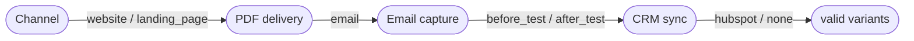

# Planning document format

One Markdown file per feature, usually `docs/variants/<feature>.md`. It is reviewed like code and doubles as the sign-off record. See [../../../examples/lead-capture-flow.md](../../../examples/lead-capture-flow.md) for a full example.

## Layout and ownership

| Part | Owner | Notes |
|---|---|---|
| Front matter | tool | revision, status, spec hash, sign-off, per-node progress |
| `# Title` and tagline | engineer | written once by `new` |
| `## Intent` | engineer | what the feature is for, in the engineer's words |
| `## Review notes` | agent | semantic findings and open questions, phrased for review |
| `## Spec` | engineer or agent | the canonical ```` ```yaml cad-spec ```` block; changes are read back and confirmed first |
| Generated region | tool | between the `cad:generated` markers; rewritten by every `render` |
| `## Changelog` | tool | newest first; the note passed to `render` becomes the entry text |

Edits inside the generated region are lost on the next `render`. Everything else is preserved.

## Front matter

```yaml
cad: 1
feature: lead-capture-flow
revision: 2                 # bumps when the spec hash changes
status: draft               # draft | approved | implementing | done
spec_hash: 1f0c9a3e5b21     # of the parsed spec, so comments and formatting do not count
approved:                   # present only while valid
  by: Dana (product)
  on: 2026-09-24
  hash: 1f0c9a3e5b21
counts: {theoretical: 108, valid: 52, scenarios: 52, nodes: 17}
nodes:
  opt.email_capture.after_test:
    branch: lead-capture-flow/email-capture-after-test
    onto: lead-capture-flow/email-capture
    status: mr-open         # planned | branched | mr-open | merged
    mr: "!7"
    restack_from: ...       # set by render when a started branch needs a new parent
    obsolete: true          # started work that the current spec no longer plans
```

Update progress with `cad.py mark`, never by hand. The front matter is machine-owned. Planned follow-ups are listed under `followups`, and nodes whose contract changed after work started carry `needs_update`.

Contract snapshots of started nodes live in an HTML comment at the very end of the document (`<!-- cad:contracts ... -->`). They are invisible when rendered and let `render` detect what changed; see [changes.md](changes.md).

## Generated region

1. **Decision space**: the counts table, plan status, and any confirmation reasons with options.
2. **Decision tree**: a Mermaid diagram of the valid variants (see below).
3. **Dimensions**: options with no-op, dead and not-targeted markers, plus `applies_when`.
4. **Constraints**: each rule with how many combinations it removes, how many only it removes, and findings. A constraint map diagram is folded below.
5. **Findings**: tool findings (errors, warnings, info).
6. **Implementation plan**: node counts, the MR stack diagram, the stack table (merge order), and one block per node with id, decisions, scope, dependencies and why they exist, components, expected files, risk and complexity, branch and target, status, guidance, tests, scenarios, acceptance criteria, and a ready-to-use MR description.
7. **Test matrix**: mode, an explicit statement of what the matrix does and does not cover, coverage numbers for pairwise and t-wise, and the scenario table (folded when long).

## Mermaid conventions

**Decision tree.** A reduced decision diagram: one node per remaining decision, edges labeled with options, and every left-to-right path is exactly one valid variant. Branches whose continuations are identical are merged, and decisions that do not apply are skipped. The lead-capture example draws all 42 variants with 8 decision nodes. When the reduced diagram would exceed 60 nodes it is omitted and the tables remain complete. An excerpt:



**Constraint map.** One subgraph per dimension with its options. Simple rules are direct edges (`-->` requires, `--x` excludes, labeled with the constraint id). Compound rules use a hexagon node per constraint. `applies_when` is a dotted `enables` edge into the conditional dimension. Classes: `noop` (dashed), `out` (not targeted), `dead` (red).

**MR stack.** Top-down from the base branch. Node labels are the MR title plus the node id. A dotted edge from the base branch marks a later wave. Classes by status: `branched`, `mr-open`, `merged`.

Diagrams use only flowchart syntax with quoted labels, so GitHub, GitLab and most Markdown viewers render them.
